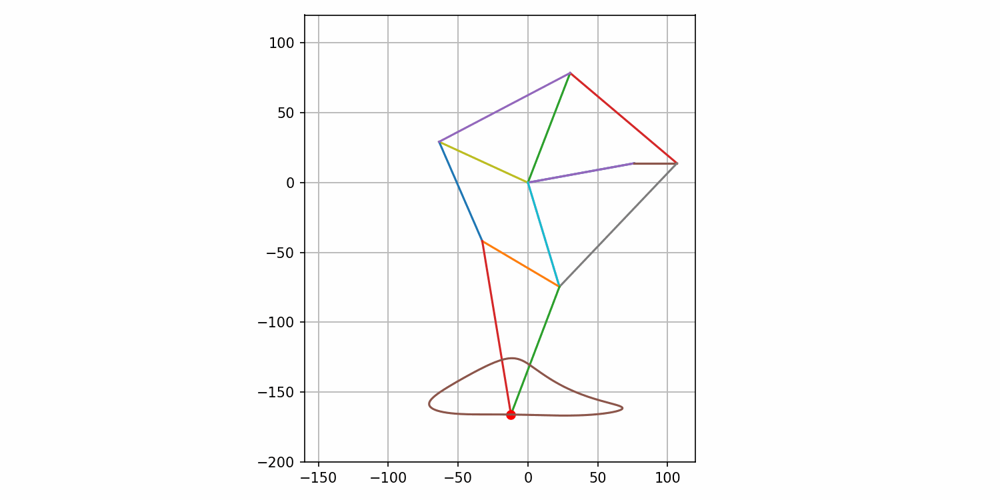
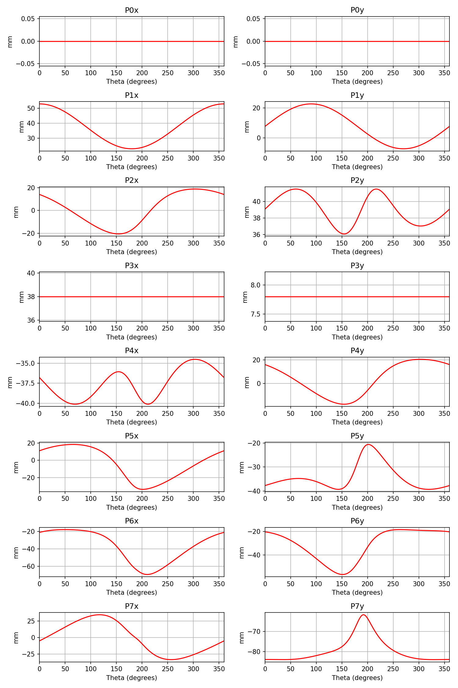
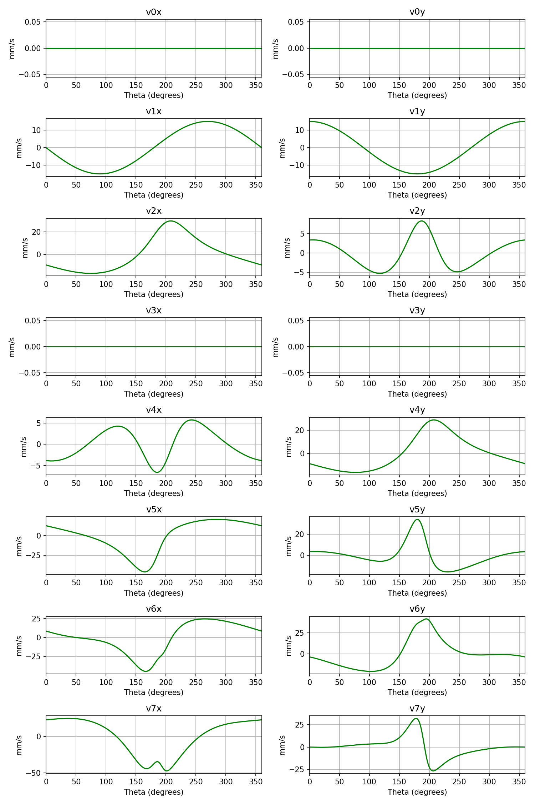
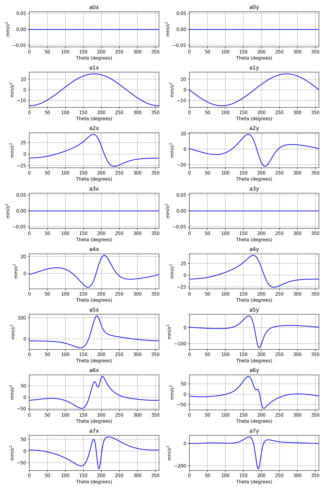

# Theory-of-Mechanisms
This is the repository for the programs used for the course ME6221 (Theory of Mechanisms) to design, analyse and synthesize the [Jansen Linkage](https://en.wikipedia.org/wiki/Jansen%27s_linkage)

## File structure
```python
.
├── data
├── outputs                                 # All the final plots are saved here
│   ├── dimension_synthesis
│   ├── dynamic_analysis
│   └── kinematic_analysis
├── README.md
└── scripts
    ├── dimension_synthesis_jansen.ipynb    # Program for dimension synthesis 
    ├── dynamic_analysis_jansen.ipynb       # Program for dynamic analysis
    ├── jansen_linkage.py
    ├── kinematic_analysis_jansen.ipynb     # Program for kinematic analysis
    └── tom_utils.py

```
## Dimension synthesis
Dimension synthesis is the process of determining the dimensions of the components of a mechanism. The following plots show parts of the mechanism assembled in 4 key positions.
<p float="left">
  
  
</p>


## Kinematic analysis
The objective of kinematic analysis is to determine the position, velocity and acceleration of the links of a mechanism.
<p float="left">
  
</p>
<p float="left">
  
  
    
</p>

## Dynamic analysis
The objective of kinematic analysis is to determine the reaction forces at the joints and input torques when a mechanism is subject to external forces.
*(Naming conventions are presented in data/jansen_dynamics.jpg)*
<p float="left">
  
</p>
<p float="left">
  
</p>


